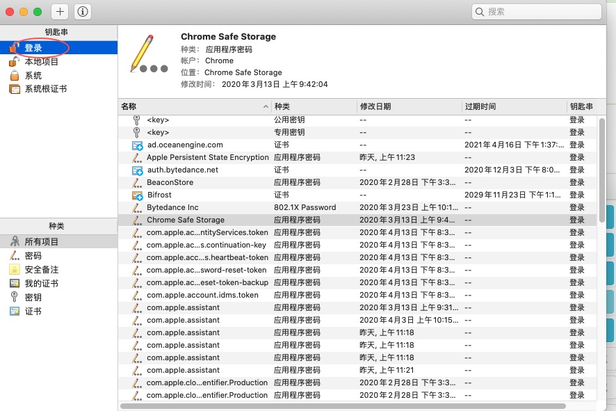

## 新版本Chrome证书不被认可

### 问题描述
在老版本的chrome中，如果你自签发了一个证书，然后通过https访问的话，会看到一个警告。

只要点击**advanced**，然后点击同意继续，就可以访问网页了。

但是新版本的MacOs自带的chrome，或者是2019年9月之后发布的chrome之后，会发现即使点击了advanced，也无法继续了，对此，有两种方法

1. 直接在网页里任何地方点一下鼠标，使得网页获得焦点，然后手打thisisunsafe，就自动进去了，有点像黑科技，玩游戏里的那种密码一样
2. 第一种方法的话会有缺陷，比如跳到同域名下的另一个页面，可能再打一遍，很麻烦。比较好的办法是将这个证书加入到钥匙串中

### 如何解决
1. 点击url左上角的**不安全**

2. 点击**证书(无效)**

3. 弹出证书详情

4. 打开访达(finder)中的某个目录，点击证书图标，然后拖住图标，拖到finder中完成下载

5. 在**应用程序**里打开**钥匙串**

6. 点击登录, 可能需要你输入密码

7. 把下载好的证书拖入钥匙串中

8. 右击证书，显示简介

9. 点击信任，选择始终信任。

10. 关闭钥匙串，他会弹出再次输入密码的框，输入即可

11. 再次访问就ok啦。
